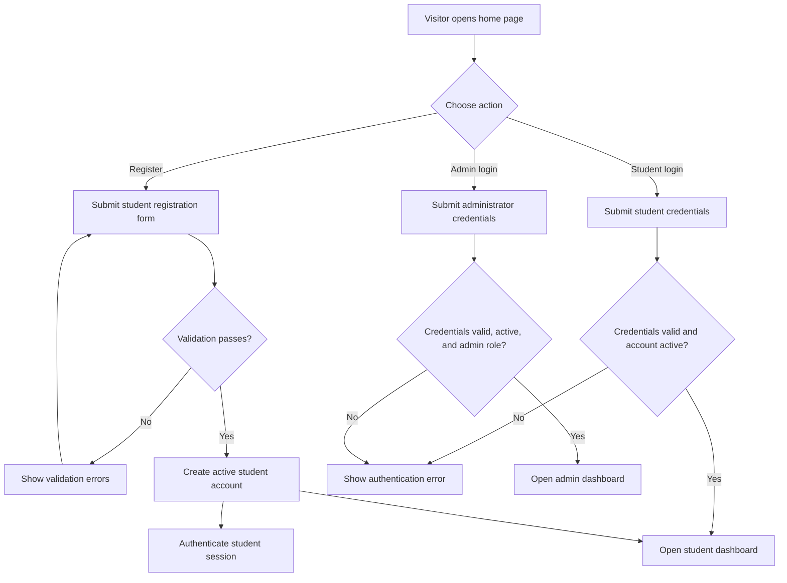
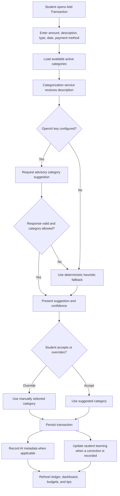
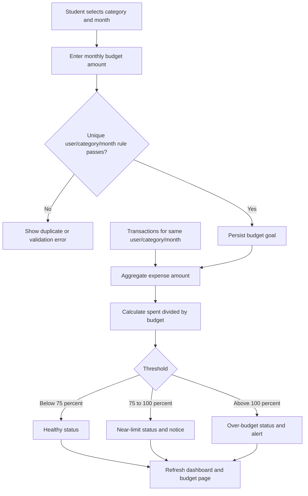
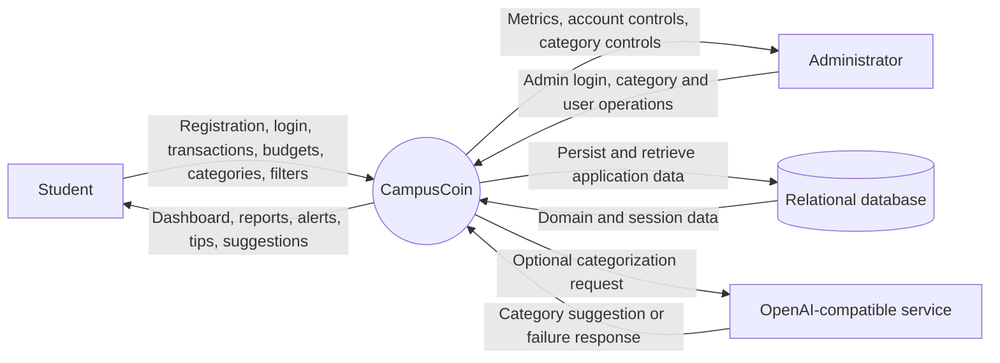
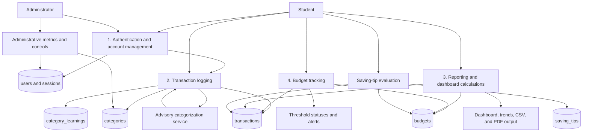
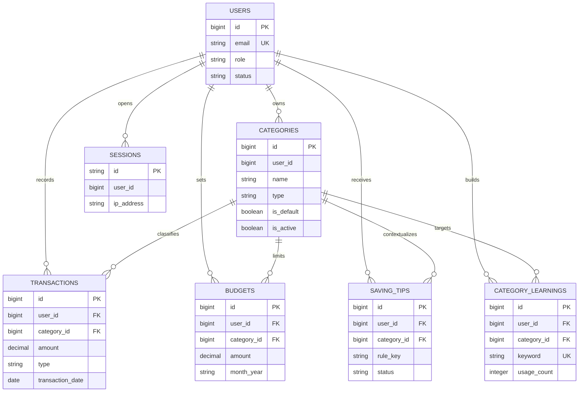

# CampusCoin Project Documentation

**Document status:** Current implementation reference
**Repository:** CampusCoin
**Verified against:** Current source tree, migrations, seeders, manifests, routes, and the local SQLite development database on 2026-09-27

> This document describes the implementation that exists in the repository. The older project notes contain historical technology and palette references that do not always match the current code; this document follows the current codebase.

## 1. PROBLEM DEFINITION

Generic personal-finance applications are commonly designed for salaried adults with predictable pay cycles, bank integrations, and conventional household spending categories. Students need a more flexible model because their money may come from allowances, part-time work, scholarships, gifts, or irregular transfers, while their spending is shaped by campus life, food, transport, housing, academics, subscriptions, entertainment, and other student-specific needs. CampusCoin addresses this gap with a manually controlled student ledger that records income and expenses, supports category-level monthly budgets, shows cash-flow and spending trends, provides deterministic saving tips, and offers optional advisory category suggestions without pretending to be a bank, payment processor, or certified financial adviser.

## 2. DESIGN SPECIFICATIONS

### 2.1 Technology stack

| Area | Implemented technology |
|---|---|
| Backend | PHP 8.3 or newer; Laravel Framework 13.17; Laravel Tinker 3.0 |
| Reactive application UI | Livewire 4.4 |
| Templates | Laravel Blade |
| Frontend styling | Tailwind CSS 4.0 with CSS-first configuration and custom design tokens in `resources/css/app.css` |
| Asset build | Vite 8.0, Laravel Vite Plugin 3.1, Tailwind Vite plugin 4.0 |
| Browser testing | Playwright Test 1.63 |
| Database default | SQLite, configured through `DB_CONNECTION=sqlite` in `.env.example` |
| Database alternatives in configuration | Laravel's database configuration can be changed for another supported relational driver, but the checked-in setup and current local environment use SQLite |
| PDF reporting | `barryvdh/laravel-dompdf` 3.1 |
| Testing | PHPUnit 12.5; Laravel test runner |
| Code quality | Laravel Pint 1.27 |
| Optional categorization integration | OpenAI-compatible HTTP endpoint; default model setting is `gpt-4o-mini`, with deterministic heuristic fallback |

No `.csproj` project exists; this is a PHP/Laravel application.

### 2.2 Three-tier architecture

#### Presentation Layer

The presentation layer is composed of Blade layouts, Blade components, Livewire views, Tailwind utility classes, and the custom CSS design system. Student pages are exposed through Livewire components for the Dashboard, Transactions, Budgets, Categories, Reports, and Saving Tips screens. Admin pages use separate Livewire components for the admin dashboard, global category management, and user management. Blade components provide reusable buttons, badges, fields, tables, modals, empty states, stat strips, icons, and layouts. Alpine.js behavior embedded in the views handles lightweight client-side concerns such as modal visibility, mobile navigation, theme initialization, and animations.

#### Application/API Layer

`routes/web.php` defines public, authentication, student-protected, report-export, and admin-protected routes. Laravel controllers handle login, registration, logout, CSV/PDF exports, and transaction CSV import boundaries. Livewire components handle reactive form actions, filtering, sorting, modal workflows, budget mutations, category management, saving-tip actions, and dashboard presentation state. Middleware enforces authentication, active-account status, and administrator authorization. Services contain financial calculations, administrator metrics, saving-tip generation, and categorization orchestration. The application does not expose a separate JSON API in the checked-in route set.

Categorization is advisory. The service can use an OpenAI-compatible provider when credentials are configured, falls back to deterministic keyword heuristics when credentials are absent or a request fails, and can use student-specific learned corrections from `category_learnings`. Manual category selection remains authoritative.

#### Data Layer

Eloquent models map application entities to relational tables. Migrations define the schema and foreign-key behavior. SQLite is the default local engine. Sessions, cache, and queued-job metadata use database-backed Laravel drivers in the checked-in environment. Domain data is scoped by authenticated user for student operations; system-default categories are shared through nullable `user_id` and `is_default` semantics.

### 2.3 UI/UX design system

The current interface uses the "Old Money Green" direction:

- Canvas and surfaces use off-white, light grey, white, and dark neutral tokens.
- Forest green is the primary accent for positive actions and income-oriented states.
- Bronze/gold is the secondary accent for savings and warning-oriented emphasis.
- Brick/expense red is used for danger and overspending states.
- Hairline borders use the shared `--hairline` token; dark navigation surfaces use a separate dark-surface hairline token.
- The application uses zero-radius rectangular controls and surfaces in the active design system. The CSS defines small radius tokens for compatibility, but the page-level visual language and landing-page rule enforce square corners.
- Buttons use solid fills at rest and invert toward an outlined treatment on hover, with color transitions controlled by the shared button classes.
- Typography uses Fraunces for display headings, IBM Plex Sans for interface text, and IBM Plex Mono for numeric and ledger-oriented values.
- Dark mode, reduced-motion behavior, skip navigation, visible keyboard focus, responsive layouts, and semantic dialog/table markup are implemented.

### 2.4 Implemented screens and routes

| Screen | Route | Main responsibilities |
|---|---|---|
| Home | `/` | Public product introduction, calls to action, and visible application sitemap section |
| Student login | `/login` | Student authentication |
| Student registration | `/register` | New student account creation |
| Admin login | `/admin/login` | Direct administrator authentication |
| Dashboard | `/dashboard` | Safe-to-spend view, KPI strip, budget consumption, saving opportunities, historical cash flow, category trends, recent entries |
| Transactions | `/transactions` | Add, edit, delete, filter, sort, search, recurring flag, CSV import, CSV export, advisory categorization |
| Budgets | `/budgets` | Monthly category budget creation, editing, deletion, consumption, 75% warning, over-budget alert |
| Categories | `/categories` | Student-owned custom categories and shared system categories |
| Reports | `/reports` | Monthly, category, six-month, daily, weekly, and ledger report views; CSV and PDF export |
| Saving Tips | `/tips` | Rule-generated tips with active, pinned, and dismissed states |
| Admin dashboard | `/admin/dashboard` | Operational metrics, category usage, cohort distribution, and recent account activity |
| Admin categories | `/admin/categories` | Global category controls, activation state, creation, editing, and safe deletion |
| Admin users | `/admin/users` | Account search/filtering, inspection, activation/deactivation, and baseline management |

## 3. DIAGRAMS

### 3.1 User registration and login flow

### 3.2 Add transaction flow with categorization suggestion

### 3.3 Budget goal and alert flow

### 3.4 Data Flow Diagram Level 0

### 3.5 Data Flow Diagram Level 1

## 4. DATABASE DESIGN

### 4.1 ER diagram

There is no `insights` table in the current implementation. The implemented generated-advice table is `saving_tips`; the SRS term "Insight" is therefore represented by saving-tip records and report calculations rather than a separate table.

### 4.2 Domain tables

#### `users`

| Column | Declared type | Key / nullability | Description |
|---|---|---|---|
| `id` | BIGINT primary key | PK, not null, auto-increment | User identifier |
| `name` | VARCHAR(255) | Not null | Display name |
| `email` | VARCHAR(255) | Not null, unique | Login email |
| `email_verified_at` | TIMESTAMP | Nullable | Verification timestamp |
| `password` | VARCHAR(255) | Not null | Hashed password |
| `role` | ENUM(student, admin) | Not null, indexed, default student | Authorization role |
| `status` | ENUM(active, disabled) | Not null, indexed, default active | Account status |
| `academic_year` | ENUM(Freshman, Sophomore, Junior, Senior, Graduate) | Nullable | Student cohort |
| `monthly_allowance` | DECIMAL(10,2) | Not null, default 0.00 | Baseline monthly inflow |
| `savings_goal` | DECIMAL(10,2) | Not null, default 0.00 | Target savings amount |
| `remember_token` | VARCHAR(100) | Nullable | Laravel persistent-login token |
| `created_at` | TIMESTAMP | Nullable | Creation timestamp |
| `updated_at` | TIMESTAMP | Nullable | Update timestamp |

Description: Stores student and administrator identities, authorization state, academic cohort, and financial baseline values.

#### `categories`

| Column | Declared type | Key / nullability | Description |
|---|---|---|---|
| `id` | BIGINT primary key | PK, not null, auto-increment | Category identifier |
| `user_id` | BIGINT | Nullable, FK to `users.id`, cascade delete | Owner; null identifies a system category |
| `name` | VARCHAR(100) | Not null | Category label |
| `type` | ENUM(income, expense) | Not null, indexed | Cash-flow direction |
| `icon` | VARCHAR(50) | Not null, default tag | UI icon name |
| `color` | VARCHAR(20) | Not null, default #059669 | Category color value |
| `is_default` | BOOLEAN | Not null, indexed, default false | Shared system-category flag |
| `is_active` | BOOLEAN | Not null, default true | Whether the category is selectable for new entries |
| `created_at` | TIMESTAMP | Nullable | Creation timestamp |
| `updated_at` | TIMESTAMP | Nullable | Update timestamp |

Description: Classifies income and expense entries and supplies category display metadata.

#### `transactions`

| Column | Declared type | Key / nullability | Description |
|---|---|---|---|
| `id` | BIGINT primary key | PK, not null, auto-increment | Transaction identifier |
| `user_id` | BIGINT | Not null, FK to `users.id`, cascade delete | Owning student |
| `category_id` | BIGINT | Not null, FK to `categories.id`, restrict delete | Applied category |
| `type` | ENUM(income, expense) | Not null, indexed | Transaction direction |
| `amount` | DECIMAL(10,2) | Not null | Exact currency amount |
| `merchant` | VARCHAR(150) | Not null | Merchant or source label |
| `description` | TEXT | Nullable | Additional description |
| `transaction_date` | DATE | Not null, indexed | Occurrence date |
| `payment_method` | ENUM(cash, card, bank_transfer, upi, digital_wallet, other) | Not null, default card | Payment channel |
| `is_recurring` | BOOLEAN | Not null, default false | Recurrence marker |
| `ai_suggested` | BOOLEAN | Not null, default false | Whether categorization was suggested |
| `ai_confidence` | DECIMAL(3,2) | Nullable | Advisory confidence score |
| `created_at` | TIMESTAMP | Nullable | Creation timestamp |
| `updated_at` | TIMESTAMP | Nullable | Update timestamp |

Description: The student cash-flow ledger.

#### `budgets`

| Column | Declared type | Key / nullability | Description |
|---|---|---|---|
| `id` | BIGINT primary key | PK, not null, auto-increment | Budget identifier |
| `user_id` | BIGINT | Not null, FK to `users.id`, cascade delete | Owning student |
| `category_id` | BIGINT | Not null, FK to `categories.id`, cascade delete | Budgeted category |
| `amount` | DECIMAL(10,2) | Not null | Monthly cap |
| `month_year` | VARCHAR(7) | Not null, indexed | `YYYY-MM` budget period |
| `created_at` | TIMESTAMP | Nullable | Creation timestamp |
| `updated_at` | TIMESTAMP | Nullable | Update timestamp |

Description: Stores one monthly spending limit per student/category/month; the compound user/category/month combination is unique.

#### `saving_tips`

| Column | Declared type | Key / nullability | Description |
|---|---|---|---|
| `id` | BIGINT primary key | PK, not null, auto-increment | Tip identifier |
| `user_id` | BIGINT | Not null, FK to `users.id`, cascade delete | Owning student |
| `rule_key` | VARCHAR(255) | Not null | Deterministic rule identifier |
| `category_id` | BIGINT | Nullable, FK to `categories.id`, cascade delete | Related category when applicable |
| `title` | VARCHAR(255) | Not null | Tip heading |
| `message` | TEXT | Not null | Trigger explanation |
| `suggestion` | TEXT | Not null | Recommended action |
| `trigger_data` | JSON | Nullable | Stored metric snapshot |
| `estimated_savings` | DECIMAL(10,2) | Not null, default 0.00 | Estimated possible saving |
| `status` | VARCHAR(20) | Not null, default active | active, dismissed, or pinned |
| `dismissed_at` | TIMESTAMP | Nullable | Dismissal timestamp |
| `pinned_at` | TIMESTAMP | Nullable | Pin timestamp |
| `created_at` | TIMESTAMP | Nullable | Creation timestamp |
| `updated_at` | TIMESTAMP | Nullable | Update timestamp |

Description: Stores user-scoped deterministic saving opportunities and their lifecycle state.

#### `category_learnings`

| Column | Declared type | Key / nullability | Description |
|---|---|---|---|
| `id` | BIGINT primary key | PK, not null, auto-increment | Learning identifier |
| `user_id` | BIGINT | Not null, FK to `users.id`, cascade delete | Student owner |
| `keyword` | VARCHAR(100) | Not null, unique per user | Normalized description keyword |
| `category_id` | BIGINT | Not null, FK to `categories.id`, cascade delete | Preferred category |
| `usage_count` | UNSIGNED INT | Not null, default 1 | Number of repeated confirmations/corrections |
| `last_used_at` | TIMESTAMP | Nullable | Most recent use |
| `created_at` | TIMESTAMP | Nullable | Creation timestamp |
| `updated_at` | TIMESTAMP | Nullable | Update timestamp |

Description: Stores student-specific corrections used to improve future category suggestions.

### 4.3 Laravel infrastructure tables

These tables are created by the Laravel application skeleton and support framework operation rather than CampusCoin business features.

| Table | Columns |
|---|---|
| `password_reset_tokens` | `email` VARCHAR(255) PK; `token` VARCHAR(255); `created_at` TIMESTAMP nullable |
| `sessions` | `id` VARCHAR(255) PK; `user_id` BIGINT nullable/indexed (application association, not a declared foreign key); `ip_address` VARCHAR(45) nullable; `user_agent` TEXT nullable; `payload` LONGTEXT; `last_activity` INT indexed |
| `cache` | `key` VARCHAR(255) PK; `value` MEDIUMTEXT; `expiration` BIGINT indexed |
| `cache_locks` | `key` VARCHAR(255) PK; `owner` VARCHAR(255); `expiration` BIGINT indexed |
| `jobs` | `id` BIGINT PK; `queue` VARCHAR(255) indexed; `payload` LONGTEXT; `attempts` UNSIGNED SMALLINT; `reserved_at` UNSIGNED INT nullable; `available_at` UNSIGNED INT; `created_at` UNSIGNED INT |
| `job_batches` | `id` VARCHAR(255) PK; `name` VARCHAR(255); `total_jobs` INT; `pending_jobs` INT; `failed_jobs` INT; `failed_job_ids` LONGTEXT; `options` MEDIUMTEXT nullable; `cancelled_at` INT nullable; `created_at` INT; `finished_at` INT nullable |
| `failed_jobs` | `id` BIGINT PK; `uuid` VARCHAR(255) unique; `connection` VARCHAR(255); `queue` VARCHAR(255); `payload` LONGTEXT; `exception` LONGTEXT; `failed_at` TIMESTAMP current default; composite index on connection, queue, failed_at |
| `migrations` | `id` UNSIGNED INT PK; `migration` VARCHAR(255); `batch` INT; Laravel migration repository metadata |

### 4.4 Relationships

- One user has many transactions, budgets, owned categories, saving tips, category learnings, and sessions.
- One category has many transactions, budgets, saving tips, and category learnings.
- A system category has a null `user_id` and is available across students; a custom category belongs to one student.
- Every transaction belongs to exactly one user and one category.
- Every budget belongs to exactly one user and one category and is unique for a month.
- A saving tip belongs to one user and may optionally refer to one category.
- A category learning belongs to one user and one category; its keyword is unique within that user.
- User deletion cascades to that user’s domain records. Category deletion is restricted for transactions and guarded by application-level safe-deletion checks for other references.

## 5. TEST DATA

### 5.1 Data provenance

The following representative rows are from the current local development SQLite database on 2026-09-27. The first three accounts and the initial four transactions originate from `DatabaseSeeder`; later accounts, budgets, tips, learnings, and additional transaction rows are real development-session/test data created after seeding. Password hashes are intentionally omitted.

### 5.2 Users: current development-session rows

| ID | Name | Email | Role | Status | Academic year | Monthly allowance | Savings goal | Provenance |
|---:|---|---|---|---|---|---:|---:|---|
| 1 | Campus Coin Admin | admin@campuscoin.edu | admin | active | - | 0.00 | 0.00 | Seed |
| 2 | Alex Rivera | alex.rivera@campus.edu | student | active | Junior | 1200.00 | 300.00 | Seed |
| 3 | Maria Santos | maria.santos@campus.edu | student | active | Sophomore | 950.00 | 200.00 | Seed |
| 4 | Alex Martin | alex@aptech.com | student | active | Graduate | 6000.00 | 1500.30 | Development session |
| 5 | ali | ali@gmail.com | student | active | Junior | 50000.00 | 500.00 | Development session |
| 6 | Michael Obama | michael1@gmail.com | student | active | Junior | 999.98 | 200.00 | Development session |

### 5.3 Categories: representative system rows

| ID | Name | Type | Icon | Default | Active | Provenance |
|---:|---|---|---|---|---|---|
| 1 | Allowance | income | wallet | yes | yes | Seed |
| 2 | Part-time Job | income | activity | yes | yes | Seed |
| 3 | Scholarship | income | graduation-cap | yes | yes | Seed |
| 4 | Gift | income | target | yes | yes | Seed |
| 5 | Other Income | income | plus | yes | yes | Seed |
| 6 | Food | expense | pie-chart | yes | yes | Seed |
| 7 | Transport | expense | trending-down | yes | yes | Seed |
| 8 | Hostel/Rent | expense | lock | yes | yes | Seed |
| 9 | Academics | expense | graduation-cap | yes | yes | Seed |
| 10 | Subscriptions | expense | calendar | yes | yes | Seed |

The seed also creates Entertainment and Miscellaneous, for a total of 12 system categories.

### 5.4 Transactions: representative current rows

| ID | User | Category | Type | Amount | Merchant | Date | Payment method | Recurring | AI suggested | Confidence | Provenance |
|---:|---:|---:|---|---:|---|---|---|---|---|---:|---|
| 1 | 2 | 1 | income | 1200.00 | Family Allowance Transfer | 2026-09-01 | bank_transfer | yes | no | - | Seed |
| 2 | 2 | 6 | expense | 24.50 | Campus Dining Hall | 2026-09-21 | card | no | no | - | Seed |
| 3 | 2 | 9 | expense | 68.00 | University Bookstore | 2026-09-19 | card | no | no | - | Seed |
| 4 | 2 | 7 | expense | 15.00 | Campus Metro Shuttle | 2026-09-17 | digital_wallet | no | no | - | Seed |
| 7 | 2 | 1 | income | 50.00 | Bookstores | 2026-09-27 | cash | yes | no | - | Development session |
| 8 | 2 | 1 | income | 50.00 | testing | 2026-09-27 | card | no | yes | 0.92 | Development session |
| 9 | 2 | 6 | expense | 24.50 | Lunch & coffee with study group | 2026-09-21 | card | no | yes | 0.75 | Development session |
| 10 | 2 | 9 | expense | 68.00 | Algorithms & Data Structures textbook | 2026-09-19 | card | no | yes | 0.75 | Development session |
| 11 | 2 | 7 | expense | 15.00 | Weekly campus transit card reload | 2026-09-17 | card | no | yes | 0.75 | Development session |
| 17 | 2 | 5 | income | 300.00 | Monthly family living allowance baseline | 2026-09-01 | card | no | no | - | Development session |

The current database contains additional test rows, including IDs 12-16; the table above is a representative sample rather than a clean fixture export.

### 5.5 Budgets

| ID | User | Category | Amount | Month | Provenance |
|---:|---:|---:|---:|---|---|
| 1 | 5 | 10 | 700.00 | 2026-09 | Development session |

### 5.6 Saving tips

| ID | User | Rule | Category | Estimated savings | Status | Provenance |
|---:|---:|---|---:|---:|---|---|
| 1 | 2 | high_spending_share | 9 | 25.00 | dismissed | Development session |
| 2 | 4 | savings_goal_lagging | - | 1500.30 | active | Development session |
| 3 | 5 | savings_goal_lagging | - | 500.00 | pinned | Development session |
| 4 | 6 | savings_goal_lagging | - | 200.00 | active | Development session |

### 5.7 Category learnings

| ID | User | Keyword | Category | Usage count | Provenance |
|---:|---:|---|---:|---:|---|
| 1 | 5 | none | 10 | 2 | Development session |
| 2 | 5 | bookstores | 10 | 2 | Development session |
| 3 | 2 | testing | 1 | 3 | Development session |
| 4 | 2 | bookstores | 1 | 1 | Development session |
| 5 | 2 | lunch & coffee with study group | 6 | 2 | Development session |
| 6 | 2 | algorithms & data structures textbook | 9 | 2 | Development session |
| 7 | 2 | weekly campus transit card reload | 6 | 2 | Development session |
| 8 | 2 | monthly family living allowance baseline | 5 | 2 | Development session |

## 6. INSTALLATION INSTRUCTIONS

Detailed evaluator installation, database setup, default URLs, working credentials, assumptions, SQL-export status, and sitemap status are intentionally repeated in the separate `ReadMe.doc` file so they remain easy to find.

At a high level, the current repository uses Laravel's normal Composer/npm workflow, `.env.example` defaults to SQLite, migrations create the schema, and the standard local application URL is `http://localhost:8000`. There is no checked-in SQL dump; the migration files are the authoritative schema source.

## 7. USER CREDENTIALS

The following credentials are defined in `database/seeders/DatabaseSeeder.php` and are the evaluator credentials. Their plaintext passwords are known from the seeder, so no password reset was required.

### Student account

- Login URL: `http://localhost:8000/login`
- Email: `alex.rivera@campus.edu`
- Password: `StudentSecure123!`
- Role: student
- Account status: active

### Administrator account

- Login URL: `http://localhost:8000/admin/login`
- Email: `admin@campuscoin.edu`
- Password: `AdminSecure123!`
- Role: admin
- Account status: active

The seed data also defines `maria.santos@campus.edu` with the same student password for tenant-isolation testing. The current development database contains additional manually registered accounts whose passwords are not recorded in the repository; they are not claimed as evaluator credentials.

## 8. ASSUMPTIONS

The implementation clarifies or diverges from ambiguous SRS wording in these ways:

- There is no separate `insights` table. The implemented `saving_tips` table stores generated, user-scoped saving opportunities and performs the practical role described by the SRS as generated insights. Dashboard and report narratives are calculated from ledger data and saving-tip rules.
- The checked-in `.env.example` uses SQLite for a simple local setup. The active local `.env` currently uses MySQL with database `campus_coin`. The migration-based SQLite schema export is supplied separately as `CampusCoin_schema.sql`; it is not a dump of the active MySQL data.
- There is no separate JSON API in the current route set. The application uses Laravel web routes, Blade, Livewire, controllers, and server-rendered responses.
- There is no live bank integration, bank-account verification, payment processing, or money transfer. Transactions are entered manually or imported through the CSV workflow.
- AI categorization is optional and advisory. An OpenAI-compatible provider is used only when configured; missing credentials, API failures, and timeouts use deterministic heuristic categorization. Students can manually override suggestions.
- Student corrections are learned per user through `category_learnings`; one student's corrections do not influence another student.
- Saving tips are deterministic rule-generated records with active, pinned, and dismissed lifecycle states. They are not certified financial advice.
- The SRS mentions email-based password recovery and report sharing by email, but the current route set does not implement a complete email-delivery recovery flow or report-email sharing feature. These should not be presented as implemented capabilities.
- The SRS lists a broad set of possible database engines, but the repository's reproducible defaults are SQLite in `.env.example` and MySQL in the active local `.env`. No separate PostgreSQL implementation was verified.
- The current development database is not seed-only; it includes later manual users, transactions, budgets, tips, and learning records. `php artisan migrate:fresh --seed` is the clean evaluation reset.
- The home page sitemap is a real route list, not only a marketing section. The `/` page has an `Application Sitemap` section with grouped links for public access, student ledger pages, analysis pages, and staff operations.

## 9. AI TOOL ACKNOWLEDGMENT

- **GitHub Copilot:** the AI development assistant used in the VS Code workflow for codebase analysis, implementation support, validation, and documentation work.
- **OpenAI API integration:** an optional runtime AI service implemented by CampusCoin for advisory transaction categorization. The configured default model is `gpt-4o-mini`, with a deterministic heuristic fallback. This is an application integration rather than a claim that the OpenAI service authored the project.

No repository or session evidence identifies Claude, Gemini, or another AI authoring tool as having been used during development. Additional tools used outside the repository should be added by the project team before submission if applicable.
